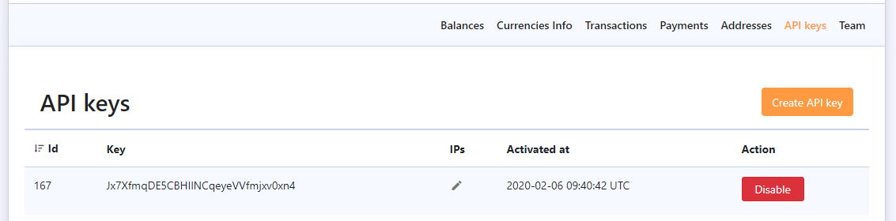

# Obtaining API Keys

Please navigate to your Merchant dashboard, find section called “API keys” and click "Activate" .

In order to activate your API key and see your secret enter 2FA code and click "Activate".

After activation you will see your secret.


Please note that after closing "Activate API key" window, you **won't be able to see it again**. Secret will be hidden and you **won’t be able to restore**, please save in a secure place and avoid sending it via messengers and even email.


