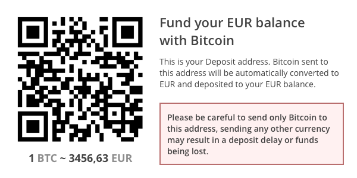

# V2

## General information

Api endpoint for all requests is:

```text
https://app.coinspaid.com/api/v2
```

#### Deposit flow

1. You obtain new address from CoinsPaid API \(for some currencies it may be address and tag\) and store it somewhere on your side. After that you show this address to your customer in order to make a deposit.
2. Customer sends some funds to this address.  
3. When transaction is sent by a customer - CoinsPaid sends a callback to your callback url with transaction details. It contains status, address, currency, amount and fees.  If status is successful, you should deposit respective amount to customer balance on your side.

#### Withdrawal flow

1. You request to send amount of money to address.
2. Your request is validated on our side. If signature is correct, address is valid and you have enough balance - CoinsPaid responds you with the transaction object.
3. You will receive a callback when transaction status is updated.

**Deposit with exchange flow**

You don't want to touch or store cryptocurrency, but only use it as a payment method. Your customer deposits **BTC**, ****Coinspaid instantly converts it to **EUR** so that **you would receive EUR on your CoinsPaid account.**

1. You obtain new address from CoinsPaid API same as in deposit flow, but additionally pass another parameter "convert\_to" in your request specifying resulting currency.
2. When new deposit is arriving, CoinsPaid converts all arriving funds to destination funds, and sends notifications as in regular deposit

**Withdrawal with exchange flow**

You wish to send Cryptocurrency from your Fiat currency balance. For example you want to **send EUR amount** but your customer ****receives ****money **in BTC.**

1. You do exactly same as in withdrawals, but you specify 2 currencies. One is a currency of your **sending balance** and Second is a **cryptocurrency your Customer wishes to receive**.
2. Your request is validated on our side. If signature is correct, address is valid and you have enough balance - CoinsPaid responds you with the transaction object.
3. You will receive a callback when transaction status is updated.

## API Enpoints



Ping



Test if API is up and running and your authorization is working











```
{}
```







Get list of supported currencies



Get all supported currencies











```
[
  {
    "id": 1,
    "type": "crypto",
    "currency": "BTC",
    "minimum_amount": "0.001",
    "deposit_fee_percent": "0.99",
    "withdrawal_fee_percent": "0",
    "precision": 8
  }
]
```







Get list of exchangeable currency pairs



Get list of currency pairs if no parameters passed.  
Get particular pair and its price if currency parameters are passed.






Filter by currency ISO that exchanges from, example: **BTC**



Filter by currency ISO that can be converted to, example: **EUR**










```
[
  {
    "currency_from": {
      "currency": "BTC",
      "type": "crypto",
      "min_amount": "0.01"
    },
    "currency_to": {
      "currency": "EUR",
      "type": "fiat"
    },
    "rate_from": "1",
    "rate_to": "3500"
  }
]
```







Receive cryptocurrency



Take address for depositing crypto and \(it depends on specified params\) exchange from crypto to fiat on-the-fly






Your info for this address, will returned as reference in Address responses, example: **user-id:2048**



ISO of currency to receive funds in, example: **BTC**



If you need auto exchange all incoming funds for example to **EUR**, specify this param as EUR or any other cupported currency ISO, to see list of pairs see previous method.










```
{
  "data": {
    "id": 1,
    "currency": "BTC",
    "convert_to": "EUR",
    "address": "12983h13ro1hrt24it432t",
    "tag": "tag-123",
    "foreign_id": "user-id:2048"
  }
}
```






Business logic for using cryptocurrency as a deposit method:   
You are willing to let your customer fund his EUR balance on your platform or website. You will have to generate an address in the desired cryptocurrency and specify EUR as a "convert\_to" currency. This will allow you to let your Customer pay if his favorite currency and fund his balance in EUR. At the same time you will see respective EUR amount in your CoinsPaid merchant account.  
**Hint:** you don't have to generate new address for this customer anymore, address can be reused unlimited amount of times.




* Make sure to use Bitcoin URI format bitcoin: in QR. Works the same way as "mailto:".
* We do recommend making this QR clickable as customers may have a wallet set up on their computer or mobile phone.
* We recommend specifying approximate current exchange rate.



Withdraw cryptocurrency



Withdraw in crypto to any specified address. You can send Cryptocurrency from your Fiat currency balance by using "convert\_to" parameter.






Unique foreign ID in your system, example: "**122929**"



Amount of funds to withdraw, example: "**3500**"



Currency ISO to be withdrawn, example: "**EUR**"



If you want to auto convert for example EUR to BTC, specify this param as **BTC** or any other currency supported \(see list of exchangeable pairs API method\).



Cryptocurrency address where you want to send funds.



Tag \(if it's Ripple\) or memo \(if it's Bitshares or EOS\)










```
{
  "data": {
    "id": 1,
    "foreign_id": "122929",
    "type": "withdrawal_exchange",
    "status": "processing"
  }
}
```






Recommendation: ask customer to specify his payout address even before allowing him to deposit, this will improve experience and help to avoid mistakes with withdrawals in future.



Business logic for using cryptocurrency as a withdrawal method:   
Your customer requests a payout in Cryptocurrency from his EUR balance on your platform. You have to specify withdrawal **amount in EUR** and **specify Cryptocurrency and its destination** \(sometimes it is not only Address\).   
Example of such request &lt;_Send 3500 EUR to Bitcoin  3D2V3tushw7VLJYnK6vZVDpNcNmEG2a7QK_"&gt;.


## Callbacks



```text
{
    "id": 1,
    "type": "deposit",
    "crypto_address": {
        "id": 1,
        "currency": "BTC",
        "address": "39mFf3X46YzUtfdwVQpYXPCMydc74ccbAZ",
        "foreign_id": "user-id:2048",
        "tag": null
    },
    "currency_sent": {
        "currency": "BTC",
        "amount": "6.53157512"
    },
    "currency_received": {
        "currency": "BTC",
        "amount": "6.53157512"
    },
    "transactions": [
        {
            "id": 1,
            "currency": "BTC",
            "transaction_type": "blockchain",
            "type": "deposit",
            "address": "39mFf3X46YzUtfdwVQpYXPCMydc74ccbAZ",
            "tag": null,
            "amount": "6.53157512",
            "txid": "3950ad8149421a850d01dff88f024810e363ac18c9e8dd9bc0b9116e7937ad93",
            "confirmations": 3
        }
    ],
    "fees": [
        {
            "type": "deposit",
            "currency": "BTC",
            "amount": "0.01959472"
        }
    ],
    "status": "confirmed"
}
```



```text
{
    "id": 1,
    "foreign_id": "10",
    "type": "withdrawal",
    "crypto_address": {
        "id": 1,
        "currency": "BTC",
        "address": "115Mn1jCjBh1CNqug7yAB21Hq2rw8PfmTA",
        "tag": null
    },
    "currency_sent": {
        "currency": "BTC",
        "amount": "0.02"
    },
    "currency_received": {
        "currency": "BTC",
        "amount": "0.02"
    },
    "transactions": [
        {
            "id": 1,
            "currency": "BTC",
            "transaction_type": "blockchain",
            "type": "withdrawal",
            "address": "115Mn1jCjBh1CNqug7yAB21Hq2rw8PfmTA",
            "tag": null,
            "amount": "0.02",
            "txid": "bb040d895ef7141ea0b06b04227d8f5dd4ee12d5b890e6e5633f6439393a666b",
            "confirmations": 3
        }
    ],
    "fees": [
        {
            "type": "mining",
            "currency": "BTC",
            "amount": "0.00007402"
        }
    ],
    "status": "confirmed"
}
```



```text
{
    "id": 1,
    "type": "deposit_exchange",
    "crypto_address": {
        "id": 1,
        "currency": "BTC",
        "convert_to": "EUR",
        "address": "34iqmVm9bGUenFYXtsWF1WTWjQM191zsfq",
        "tag": null,
        "foreign_id": "user-id:2048"
    },
    "currency_sent": {
        "currency": "BTC",
        "amount": "0.564256"
    },
    "currency_received": {
        "currency": "EUR",
        "amount": "1974.90"
    },
    "transactions": [
        {
            "id": 195,
            "currency": "BTC",
            "transaction_type": "blockchain",
            "type": "deposit",
            "address": "34iqmVm9bGUenFYXtsWF1WTWjQM191zsfq",
            "tag": null,
            "amount": "0.564256",
            "txid": "a6dbbe9931e52c1589854f3383a4f8c5c832cc71534329925becdf78042203d9",
            "confirmations": "6"
        },
        {
            "id": 196,
            "currency": "BTC",
            "currency_to": "EUR",
            "transaction_type": "exchange",
            "type": "exchange",
            "amount": "0.564256",
            "amount_to": "1974.90"
        }
    ],
    "fees": [
        {
            "type": "deposit",
            "currency": "BTC",
            "amount": "0.00169276"
        },
        {
            "type": "exchange",
            "currency": "EUR",
            "amount": "19.7490"
        },
    ],
    "status": "confirmed"
}
```



```text
{
    "id": 1,
    "foreign_id": "20",
    "type": "withdrawal_exchange",
    "crypto_address": {
        "id": 1,
        "currency": "EUR",
        "convert_to": "BTC",
        "address": "1K2btnZ8cqNFBPhaq729Mdj8W6G3w2nBbL",
        "tag": null
    },
    "currency_sent": {
        "currency": "EUR",
        "amount": "381"
    },
    "currency_received": {
        "currency": "BTC",
        "amount": "0.108823"
    },
    "transactions": [
        {
            "id": 1,
            "currency": "EUR",
            "currency_to": "BTC",
            "transaction_type": "exchange",
            "type": "exchange",
            "amount": 381,
            "amount_to": 0.108823
        },
        {
            "id": 1,
            "currency": "BTC",
            "transaction_type": "blockchain",
            "type": "withdrawal",
            "address": "1K2btnZ8cqNFBPhaq729Mdj8W6G3w2nBbL",
            "tag": null,
            "amount": 0.108823,
            "txid": "aa3345b96389e126f1ce88a670d1b1e38f2c3f73fb3ecfff8d9da1b1ce6964a6",
            "confirmations": 3
        }
    ],
    "fees": [
        {
            "type": "exchange",
            "currency": "BTC",
            "amount": "0.00108823"
        },
        {
            "type": "mining",
            "currency": "BTC",
            "amount": "0.0000399"
        }
    ],
    "status": "confirmed"
}
```



To provide authentication for the callback, coinspaid API signs the POST your api key and secret:

1. **X-Processing-Key** – Your public key
2. **X-Processing-Signature** – POST body, signed by the your secret key HMAC-SHA512

## Transaction statuses

| Status | Meaning |
| :--- | :--- |
| confirmed | **Final**. You are safe to process this transaction |
| not\_confirmed | Transaction is not yet confirmed. |
| cancelled | **Final**. This transaction is a double spend or cancelled withdrawal. Pay attention to this transaction. |
| not\_enough\_fee | Not enough money to pay fee for transfers of ETH / ERC20 / USDT, when money are deposited transactions will try to transfer. |

## Transitions

| Transaction | Transition |
| :--- | :--- |
| Successful deposit | not\_confirmed -&gt; confirmed |
| Unsuccessful deposit | not\_confirmed -&gt; cancelled |
| Deposit with transfer where [not enough fee](v2.md#transaction-statuses) | not\_confirmed -&gt; not\_enough\_fee |
| Successful withdrawal | confirmed |
| Unsuccessful withdrawal | cancelled |

