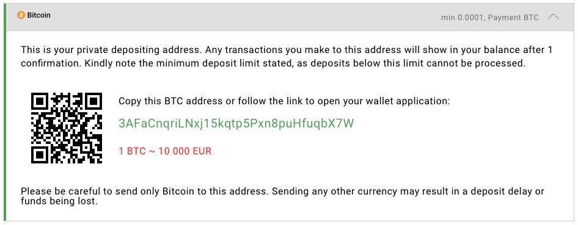

# What is crypto payment form?

## Introduction <a id="QRcodeimplementation-Introduction"></a>

Among the best practices of working with cryptocurrencies there are some recommendations how to highly increase the payment form conversion rate and total turnover.

As you may know, a payment form for crypto payments differs from classic payment methods. Users can send their money using exchanges and crypto wallet applications instead of classic payment forms. Crypto payment form is a block with the information about payment conditions and crypto address where funds should be sent. The main idea is to provide a user with deposit crypto address and all necessary information about deposit limits, exchange rates and other payment conditions. Also it will be a good idea to provide crypto address using QR code that user can use as an automatic way to open his wallet application and send a cryptocurrency in one click.

The most important features of using QR codes are:

1. Quick access from the mobile devices
2. Predefined cryptocurrency 
3. Integrated clickable link that opens the wallet application

Optional features are:

1. Predefined amount
2. Inline comments with the payment description

In this section you will know how to provide the user with all necessary information, how to implement QR codes to your payment form and what best practices exist in order to make the payment form userfriendly, to increase its conversion rate and to avoid user's mistakes.

## What is a crypto wallet URI format? <a id="QRcodeimplementation-WhatisacryptowalletURIformat?"></a>

Almost every PC user uses email links on the websites sometimes. It looks like the following link:

[address@email.com](mailto:address@email.com)\*\*\*\*


**mailto**:address@email.com


When one clicks such link an email client will be opened automatically. The user will see the form for composing a new email that contains a recipient email address in the field "To". In other cases different fields, like the field "Subject", will contain the data too.

The same user-friendly way of interaction can be used with the crypto wallets too. BTC link can be the following:


**bitcoin**:3AFaCnqriLNxj15kqtp5Pxn8puHfuqbX7W


If the user has a wallet application on his device and follows this link, wallet application will open with the specified address. In this case the user should make the only one action to click a "Pay" button in order to proceed the payment.

BTC URI supports not only the address, but also another options. For example, a payment amount.


BTC URI has a special standard "BIP-0021" described here:

[https://github.com/bitcoin/bips/blob/master/bip-0021.mediawiki](https://github.com/bitcoin/bips/blob/master/bip-0021.mediawiki)


## Why should I present a crypto address as a clickable link instead of text string? <a id="QRcodeimplementation-WhyshouldIpresentacryptoaddressasaclickablelinkinsteadoftextstring?"></a>

The common way to provide a crypto address for a user is to show him the address as a text string:


"Please, make a deposit using the following BTC address: **3AFaCnqriLNxj15kqtp5Pxn8puHfuqbX7W**"


If the user has the crypto wallet application on the same device, he should:

1. Copy this address to clipboard
2. Find and open his crypto wallet application
3. Open the "Withdraw" section in the application
4. Paste the crypto address
5. Click a "Send" button to transfer his money


The more actions user should make the more probably he would not pay. That is why **the crypto address has to be presented at least as a clickable link** using a specific URI format \(see the [What is a crypto wallet URI format?](https://docs.coinspaid.com/docs/faq/qr-codes-implementation#QRcodeimplementation-WhatisacryptowalletURIformat?) section\).


## What is a QR code? <a id="QRcodeimplementation-WhatisaQRcode?"></a>

QR code \(Quick Response code\) is a special visual method of data encoding and transferring that is usually used for simple and fast semi-automatic interaction with user's mobile devices. It can contain any text data, including URL links. When user uses his phone to scan the QR code, the data inside QR code will be decoded. If it is a link associated to a special application user's smartphone will react in a predefined way. For example, it can suggest the user to follow the URL using a web browser or to send the money using his crypto wallet application.

An example of QR code:


## Why should I use QR codes on my payment form? <a id="QRcodeimplementation-WhyshouldIuseQRcodesonmypaymentform?"></a>

As we described above, the user has to follow 5 steps in order to make a deposit, if he uses a web browser and a crypto wallet on the same device. That is why the address should be presented as a link instead of text string.

But imagine now, that user appears on a page with the payment form using his laptop and his crypto wallet application is installed on the user's smartphone.


At worst case the only way for user to pay is to type every symbol from the address manually. The most likely that the user will leave the form without the deposit. **That is why the QR code with the crypto address should be used at the same time as a link.**


## How to create QR code <a id="QRcodeimplementation-HowtocreateQRcode"></a>

What we need to provide the best user experience is only to encode into QR code a simple URI with the crypto address inside.

The simplest way to create QR code is to use Google Chart Service. It is a special service that generates universal QR codes and has very simple API to manage it. According to the request parameters QR code will contain the necessary data and it will have defined size dimensions.

A minimum set of parameters is:  
**chs** - chart image size  
**cht** - chart type \(**"qr" is necessary for QR code**\)  
**chl** - the data encoded in your QR code  
**choe** - encoding type of the QR code data


Detailed description can be found here:  
[https://developers.google.com/chart/infographics/docs/qr\_codes](https://developers.google.com/chart/infographics/docs/qr_codes)


In order to create the QR code we can use Google Chart Service and encode the URI described in [What is a crypto wallet URI format?](https://docs.coinspaid.com/docs/faq/qr-codes-implementation#QRcodeimplementation-WhatisacryptowalletURIformat?) section.

To create simple QR code including the link to the bitcoin address the following parameters should be used:  
[https://chart.googleapis.com/chart?chs=150x150&cht=qr&chl=bitcoin:3AFaCnqriLNxj15kqtp5Pxn8puHfuqbX7W&choe=UTF-8](https://chart.googleapis.com/chart?chs=150x150&cht=qr&chl=bitcoin:3AFaCnqriLNxj15kqtp5Pxn8puHfuqbX7W&choe=UTF-8)

You can use this link directly inside the &lt;img&gt; tag:

```markup

```


**chs** - QR code size \("150x150" size is used as an example\)  
**cht** - chart type \(**"qr" is necessary for QR code**\)  
**chl** - the data encoded in the QR code \("bitcoin:3AFaCnqriLNxj15kqtp5Pxn8puHfuqbX7W" has been used in the example above, but additional parameters can be used according to "BIP-0021" standard documentation: [https://github.com/bitcoin/bips/blob/master/bip-0021.mediawiki](https://github.com/bitcoin/bips/blob/master/bip-0021.mediawiki)\)  
**choe** - encoding type of the QR code data \("UTF-8" is required by "BIP-0021" standard\)

When user scans this QR code he will be able to open the wallet application and to make the deposit in one click.

## Best practice as a result <a id="QRcodeimplementation-Bestpracticeasaresult"></a>

In this article we described how to increase the conversion rate and as a result total turnover of the payment form for two scenarios. To be sure that the users will have a good experience in both cases all we need is to combine these two methods and use them on the payment form in the same time.

**So, the last step is to make the QR code clickable.**

```markup
<a href="bitcoin:3AFaCnqriLNxj15kqtp5Pxn8puHfuqbX7W" target="_blank">
  
</a>
```

After that it is no matter if the user appears on the payment form using his laptop or smartphone. He gets the possibility to make simple and fast payments in one click without any inconveniences.

To make this experience even better, it will be a good idea to provide the payment form with:

* clickable QR code
* crypto address as a link
* current or approximate exchange rate
* minimal deposit limit
* warning about the crypto currency that should be used with the specified address

As a result it will be a good form that may look like this:




